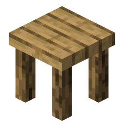
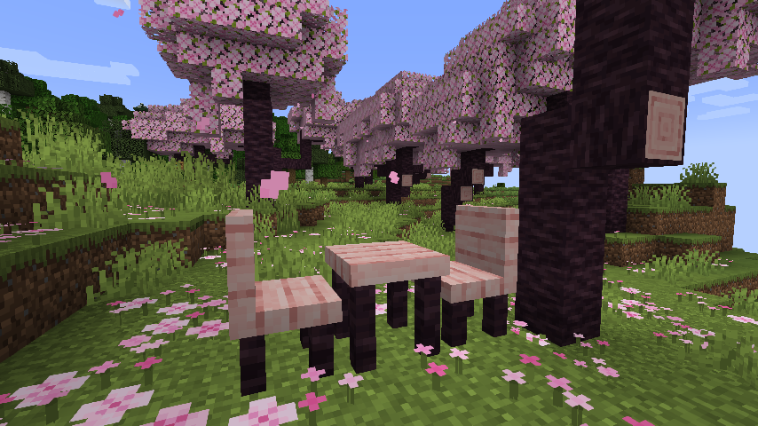
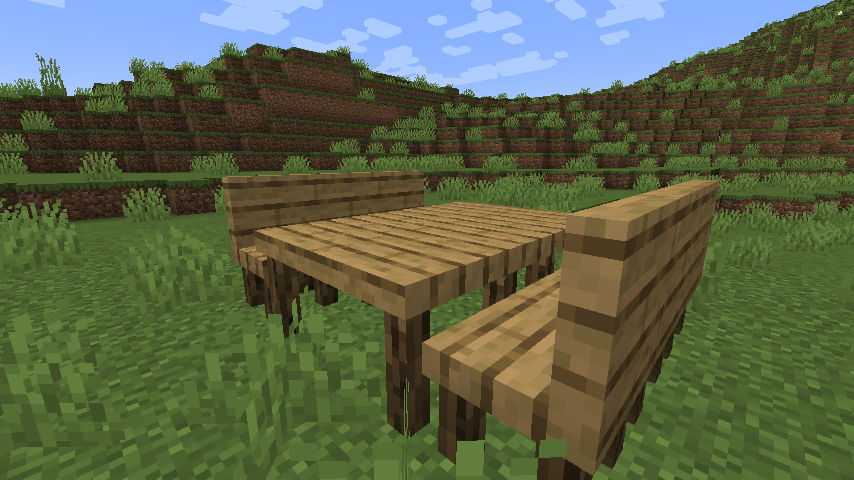
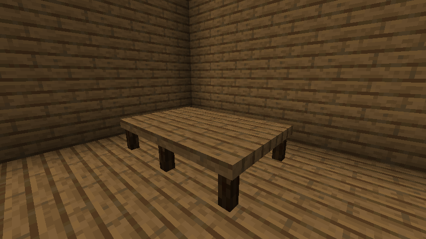

<h3 align="center">
   
  <h2 align="center">mekb's Home Appliances</h2>
  
Fabric mod that adds furniture like tables and chairs

</h3>

### Screenshots

Screenshot

Screenshot

Screenshot

### Building
- Clone the repository
- `./gradlew build` (Linux/macOS/BSD) or `gradlew.bat build` (Windows)
- Output will be in `build/libs/` named `mekbHomeAppliances-<version>.jar`
